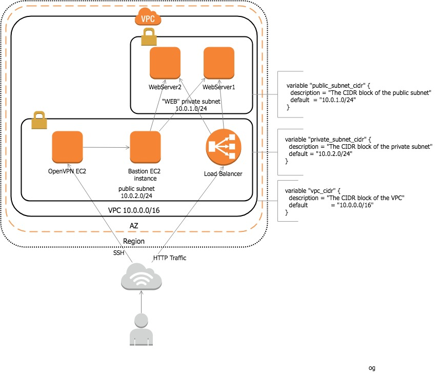

[](https://travis-ci.org/OlegGorj/vpc-with-bastionbox.terraform)


# vpcs-with-bastionbox.terraform


### Deployment:




### Step-by-step instructions:

1.  Go into 'dev' folder.

```
cd ~/dev
```

2.  create the keys pair for the dev servers

```
ssh-keygen -t rsa -C "dev_key" -f ~/.ssh/dev_key

```

3.  specify things like Access and secret key in some ways:

option 1 - Specify it directly in the provider (not recommended)

```
provider "aws" {
  region     = "us-west-1"
  access_key = "myaccesskey"
  secret_key = "mysecretkey"
}
```

option 2 - Using the shared_credentials_file to pass environment credentials

```
provider "aws" {
  region = "${var.region}"
  shared_credentials_file  = "${var.cred-file}"
}

```

where `${var.cred-file}` looks like:

```
variable "cred-file" {
  default = "~/.aws/credentials"
}

```
File `~/.aws/credentials` has following format:

```
[default]
aws_access_key_id = <your access key>
aws_secret_access_key = <your secret key>
```

Of course, there are bunch of other options to manage secrets and keys, but this is not the objective of this repo (although, it's on TODO list).

The second option is recommended because you don’t need to expose your secrets on the file.

Hence, `_main.tf` would look like:

```
provider "aws" {
  region = "${var.region}"
  shared_credentials_file  = "${var.cred-file}"
}

resource "aws_key_pair" "key" {
  key_name   = "${var.key_name}"
  public_key = "${file("dev_key.pub")}"
}

```
4. Directory structure would look like this:

```
| => tree
.
├── README.md
├── deploy.sh
├── dev
│   ├── _main.tf
│   ├── networking.tf
│   ├── output.tf
│   ├── terraform.tfstate
│   ├── terraform.tfvars
│   ├── variables.tf
│   └── web.tf
└── modules
    ├── networking
    │   ├── main.tf
    │   ├── output.tf
    │   └── variables.tf
    └── web
        ├── files
        │   └── user_data.sh
        ├── main.tf
        ├── output.tf
        └── variables.tf

```

5. Run this command on dev folder: (Terraform’s commands should be run on the environments folder).

```
=> cd ~/dev
=> terraform init
=> terraform get
=> terraform plan
```

You should see a lot of output ending with this

```
Plan: 21 to add, 0 to change, 0 to destroy.

```

6.  and, finally, apply the changes

```
=> terraform apply

```

After a while you should see this...

```

Apply complete! Resources: 21 added, 0 changed, 0 destroyed.

Outputs:

elb_hostname = dev-web-lb-702130120.us-west-1.elb.amazonaws.com


```

7.  Access Web server via LB

If you run command `terraform output elb_hostname`, you should get public DNS address of LB

```
dev-web-lb-702130120.us-west-1.elb.amazonaws.com
```

Copy and paste it into the browser window, specify port 80

```
dev-web-lb-702130120.us-west-1.elb.amazonaws.com:80
```

You should see Nginx welcome screen.


8. SSH to Web nodes

Your web nodes don't have public IPs, hence in order to SSH them, you need to use bastion node.
Get the bastion node public IP (in my case it was ec2-18-144-46-178.us-west-1.compute.amazonaws.com) and SSH to it with the flag `-A` to enable agent forwarding, as such:

```
chmod 400 ~/.ssh/dev_key.pub

ssh-add -K ~/.ssh/dev_key

ssh -A ubuntu@ec2-18-144-46-178.us-west-1.compute.amazonaws.com

```

At this point, you should see prompt of Bastion host:
```
ubuntu@ip-10-0-1-71:
```

Now, inside Bastion host, you can connect to Web servers (you can find Web private IPs using Console).

Web node 1:
```
ssh ubuntu@10.0.2.182

```

Web node 2:
```
ssh ubuntu@10.0.2.33

```

9. Destroy everything

And the last step is to destroy all setup

```
=> terraform destroy

```

---


## TODO

- split public subnet into 2 subnets: public and private Devops
- add VPN to private Devops subnet
- use docker to deploy Ngnix


---
